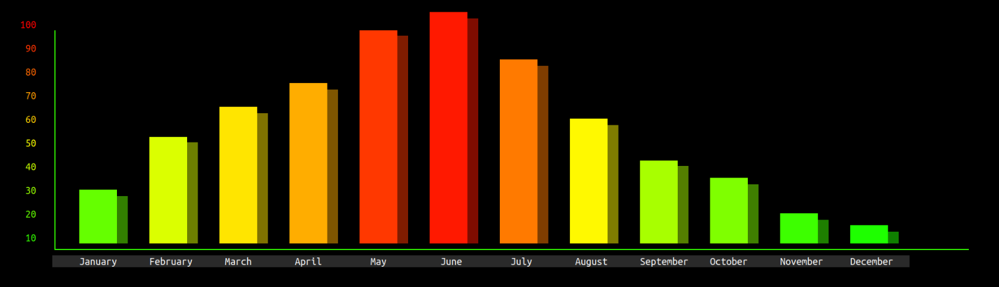

# PixelDING  becomes COLORFUL


## What is PixelDING ?
It's not easy to describe the complete purpose of PixelDING. It started with the idea to have in our microservices nice looking text statistic in the console logs.
First there were just straight lines - in an SVG like path string as output to the **console**.
Over the time more and more things got implemented, and it is still not finished.




Let's have a look of some samples.
----
### Picture support


----
### Simple things


Circles, Rectangles, Lines and Ellipses

### Bezier things


Simple and complex Bezier curves

### Arc und Lines


### SVG Path things


SVG compatible and scalable paths

### Font things


Fonts for Text

### Stamps


Stamps (Bitmaps)

# Let's have a more detailed look into

## Small Example
````GO
pixi := pixelding.New(100,100)
pixi.Circle(50,50,45)
pixi.CBezier(5,50,5,25,50,25,50,50)
pixi.CBezier(50,50,50,75,95,75,95,50)
pixi.Fill(49,51,true)
pixi.Render()
pixi.Display()
````


That should be the result. A perfect circle Yin and Yang showing up in yor console.
>Note: Depending on the console font size the result could be squeezed horizontal or vertical, see the Aspect command for compensating this.

----
# Preparations and Information

## Coordinates
Whenever there is a X and Y coordinate used, it is zero based. On an paint area of 200 by 200 dimensions the X and Y coordinate range is from 0 to 199.


### New(dimensions... int) PixelDING
Initialize and return a PixelDING object. If you want you can specify the dimensions X and Y for the paint area.
````GO
pd = pixelding.New(100,100) //Create and set dimensions to 100 by 100
pd = pixelding.New()        //Just Create an PixelDING object
````

----
### Dimensions(x, y int) error
Set the dimension for the paint area
````GO
pixi.Dimensions(100,100) //Set dimensions to 100 by 100
````

----
### Clear()
Clear the painting area
````GO
pixi.Clear() //Clear the painting area
````

----
### Aspect(x, y int)
Set the aspect ratio. 0 = normal, 1 = double. Due to different font metrics on different font sizes in the console, this could help you keep the aspect ratio near 1:1. The perfect font metrics would be a of square size (same height an width). If you paint a circle and the circle is squeezed horizontal, then use X aspect 1. If it is squeezed vertically use 1 at Y aspect.
````GO
pixi.Aspect(1,0) //Change the x aspect to double to reduce horizontal squeeze
````

----
### ColorMode(mode int) error
Set the color mode you want to use.
Modes are ModeTrueColor, ModeNoColor, Mode16Color, ModePaletteColor
````GO
pixi.ColorMode(pixelding.ModeTrueColor) //Change the x aspect to double to reduce horizontal squeeze
````

----
### Invert(b bool)
Enable or disable the invert mode for rendering
````GO
pixi.Invert(false)    //Normal output mode
````

----
### SetStep(x int)
Set the steps for Bezier or other curves. Default value is 15, the lesser the value the faster, but also getting rougher. The maximum Value supported is 50.
````GO
pixi.SetStep(7)
````

----
### Render() []string
### RenderSmallest() []string
### RenderXY(x1, y1, x2, y2 int) []string
Render the internal paint area. The result is returned as an string slice and internal stored in the PixelDING object saved for the Display command.

For the RenderSmallest all leading and trailing empty pixels are not rendered. If there is just one pixel painted at 75,25 on a 100 by 100 paint area there is just one pixel renderd and the string slice result consists of on char.

````GO
pixi.Render()                 //Simple Render, full dimension as set in the PixelDING object
pixi.RenderSmallest()         //Render exactly what is needed.
pixi.RenderXY(10,10,50,50)    //Render from 10,10 to 50,50
buffer := pixi.Render()       //Render AND return the result into buffer variable
````

----
### Display()
Display the rendered paint area on console output
````GO
pixi.Display()        //prints out the rendered buffer from the PixelDING object.
````

## Drawing

### Color(color ...uint32)
Set the color for foreground or foreground and background
````GO
pixi.Color(pixelding.RGB(255,0,0))   //Foreground to 100% red
pixi.Color(0xff0000,0x00ff00)  //Foreground to 100% red and background to 100% green using hex constants
````

### RGB(r,b,g uint8) uint32
Color Helper accepting red, green and blue as separate values, returning uint32
````GO
pixelding.RGB(255,0,0)   //100% red
````

### RGBMul(color uint32, mod float64) uint32
Experimental function to dim/brighten colors by factor
````GO
pixelding.RGBMul(0xffffff,0.5)   //should be returning 0x7f7f7f
````

### HSV(h, s, v float64) uint32
Experimental function to get uint32 color from hsv color values
````GO
rgbColor := HSV(0,1,1) //100% red
````

### Pixel(x, y int, set bool)
Put a pixel on the paint area at x,y if set=true. If set=false the pixel is cleared
````GO
pixi.Pixel(25,50, true)   //Paint a Pixel
pixi.Pixel(50,20, false)  //Clear the Pixel
````

----
### GetPixel(x, y int) bool
Returns true if the pixel on the paint area at x,y if set, otherwise false
````GO
result := pixi.GetPixel(25,50)   //Check if the pixel is set
````

----
### Line(x0, y0, x1, y1 int, set bool)
Paint a simple line from x0,y0 to x1,y1. Set the pixels on set=true otherwise clear them.
````GO
pixi.Line(10,10,50,50,true)       //paint a line
````

----
### DotLine(x0, y0, x1, y1 int, set bool, pattern uint8)
Paint a simple line from x0,y0 to x1,y1. Set the pixels on set=true otherwise clear them and use the bit pattern for dotted line variations.
````GO
pixi.Line(10,10,50,50,true,pixelDing.Dot1x1Pattern)       //paint a line with standard dots
pixi.Line(50,50,10,10,true,0B10010110)       //paint a line with uggly dots :
````
Predefined Pattern:

| Pattern Name    | How it looks               |
|-----------------|----------------------------|
| Dot1x1Pattern   | `- - - - - - - - - -`      |   
| Dot2x2Pattern   | `--  --  --  --  --`       |   
| Dot4x4Pattern   | `----    ----    ----`     |   
| Dot1x3Pattern   | `-   -   -   -   -   -`    |   
| Dot3x2x1Pattern | `---  -  ---  -  ---  -`   |   
| Dot6x2Pattern   | `------  ------  ------`   |   
| Dot7x1Pattern   | `------- ------- -------`  |   
| Dot5x1x1Pattern | `----- - ----- - ----- -`  |
| Dot1x7Pattern   | `       -       -       -` |
| Dot7x2Pattern   | `------  ------  -----  `  |


----
### QBezier(x1, y1, x2, y2, x3, y3 int, set bool)
Quadratic Bézier curve from x1,y1 to x3,y3, control point x2,y2. Set the pixels on set=true otherwise clear them.
````GO
pixi.QBezier(5,50,30,0,50,50)
````

----
### CBezier(x1, y1, x2, y2, x3, y3, x4, y4 int, set bool)
Cubic Bézier from x1,y1 to x4,y4. Control points x2,y2 and x3,y3. Set the pixels on set=true otherwise clear them.
````GO
pixi.CBezier(5,50,5,25,50,25,50,50)
````

----
### Rectangle(x0, y0, x1, y1 int, set bool, fill bool)
Draw a rectangle from x0,y0 to x1,y1. Set the pixels on set=true otherwise clear them. Fill the rectangle on fill=true
````GO
pixi.Rectangle(10,10,50,50,true)          //Rectangle
pixi.Rectangle(10,10,50,50,true,true)     //Rectangle filled
````

----
### Fill(x, y int, newC bool)
Floodfill, start at x,y
````GO
pixi.Floodfill(22,22)     //Floodfill starting add 22,22
````

----
### EllipseRect(x0, y0, x1, y1 int, set bool)
Draw ellipse in the given box defined by x0,y0 to x1,y1. Set the pixels on set=true otherwise clear them.
````GO
pixi.EllipseRect(10,10,100,50)
````

----
### Circle(x0, y0, r int, set bool)
Draw a circle at x0,y0 with the radius r. Set the pixels on set=true otherwise clear them.
````GO
pixi.Circle(25,25,10,true)
````

----
### DotArc(x0, y0, r int, a1, a2, step int, set bool)
Draw a dotted arc at x0,y0 with the radius r. a1 and a2 specify the degrees from and to. Set the pixels on set=true otherwise clear them.
The arc is drawn allways clockwise. So the example should show the upper half circle. (9 to 3 on the clock) 
````GO
pixi.DotArc(100,100,25,270,90,true)
````

----
### LineArc(x0, y0, r int, a1, a2, step int, set bool)
Draw an arc at x0,y0 with the radius r. a1 and a2 specify the degrees from and to. Set the pixels on set=true otherwise clear them.
The arc is drawn allways clockwise. So the example should show the lower half circle. (3 to 9 on the clock)
````GO
pixi.LineArc(100,100,25,90,270,true)
````

----
### LineRadius(x0,y0,r1,r2,a1 int, set bool)
Draw a line from an circle center point x0,y0 to the given direction in degrees a1.
The line is starting at the first radius r1 and ends at the second radius r2. Set the pixels on b=true otherwise clear them.
````GO
pixi.LineRadius(50,50,20,50,45,true)
````

LineRadius(x0,y0,r1,r2,a1 int, bs bool)


----
### SVGPath(xo,yo float64, s string, set bool, fscale ...float64)
Interprete and draw the path in s. Set the pixels on set=true otherwise clear them. Scale it by fscale.
````GO
pixi.SVGPath(0, 0, "M 5, 60 c 25, -25 50, 25 75, 12 s 50, 50 75, -15", true)
````

## Picture Support

###  Picture(picture *PixelPicture, x0, y0 int, segment int)
Display a preloaded picture(segment) at x0,y0
Segment specifies the number of the segment if the graphic loaded has segments like the animation below
With no segments use the value 1. 
````GO
pixi.Picture(AstronautAnimation,100,50,3)
````

Animation Source


Segment 3 Image


> To load an image and convert it to a pixelDING image you need to write your own converting function.
> Below is a sample for a png graphic using and "image/png".
````GO
func convertPicture(inname string, outname string) (*pixelding.PixelPicture, error) {
    myPixi := pixelding.New(0, 0)
    file, err := os.Open(inname)
    if err != nil {
        return &pixelding.PixelPicture{}, err
    }
    defer file.Close()
    bytevalue, _ := io.ReadAll(file)
    img2, err := png.Decode(bytes.NewReader(bytevalue))
    if err != nil {
        return &pixelding.PixelPicture{}, err
    }
    pp := pixelding.PixelPicture{}
    pp.SizeX = img2.Bounds().Max.X - img2.Bounds().Min.X
    pp.SizeY = img2.Bounds().Max.Y - img2.Bounds().Min.Y
    pp.SegX = pp.SizeX
    pp.SegY = pp.SizeY
    pp.Mode = pixelding.ModeTrueColor  
	for y := img2.Bounds().Min.Y; y < img2.Bounds().Max.Y; y++ {
	    for x := img2.Bounds().Min.X; x < img2.Bounds().Max.X; x++ {
            c := img2.At(x, y)
            r, g, b, _ := c.RGBA()
            myPixi.Color(pixelding.RGB(uint8(r), uint8(g), uint8(b)))
            pp.Data = append(pp.Data, pixelding.RGB(uint8(r), uint8(g), uint8(b)))
            myPixi.Pixel(0+x, 0+y, true)
        }
    }
    err = myPixi.SavePicture(outname, &pp, 0666)    
	if err != nil {
        return &pixelding.PixelPicture{}, err
    }
    return &pp, nil
}
````
If you're using this function to load and convert an animation source file like the blue astronaut, just specify the segment sizes, pixelDING handles the rest.
````GO
p0, err := convertPicture("animation.png", "astro.pic")
p0.SegX = 32
p0.SegY = 32
````

### LoadPicture(name string) *PixelPicture
````GO
myAstronaut := pixi.LoadPicture("astro.pic")
if pixi.Lasterror =! nil {
	//...something gone wrong
}
pixi.LoadPicture("./wherever/to/find/image.pic")
````

### SSavePicture(name string, picture *PixelPicture, permissions os.FileMode)
````GO
pixi.SavePicture("mypicture.pic", myPictre, 0666)
if pixi.Lasterror =! nil {
    //...something gone wrong
}
````

>Adding, Deleting and getting Pictures from pixelDING

### AddPicture(name string, picture *PixelPicture)
Like fonts and stamps, pictures can be stored/cached within the pixelDING object.
````GO
pixi.AddPictre("res A1-3",myAstronaut)
````

### RemovePicture(name string)
And removed...
````GO
pixi.RemovePicture("res A1-3")
````

### GetPicture(name string) *PixelPicture
And loaded if needed again
````GO
displayPicture := pixi.GetPicture("rea A1-3")
if displayPicture == nil {
	//... not found
}

````

>Please note, that you have full control of the pixelPicture structure, at the moment there are no getter or setters for that structure to enable full control over the data. 


## Font and Stamp Loading

----
### FontPrint(font *PixelFont, x, y int, text string, set bool)
Print out the text string at x,y on the paint area, Set the pixels on set=true otherwise clear them.
````GO
pixi.FontPrint(myFont,20,20,"This is a test", true)       //Write on the paint area, mode pixel set
pixi.FontPrint(pixi.GetFont("copper"),20,50,"(a+b)=x",true) //Use a stored font "copper"
````

----
### Stamp(x, y int, stamp *PixelStamp, set bool, st bool)
Set the pixels on set=true otherwise clear them. Stamp mode if st=true. Stamp mode means, that the bitmap is transfered to the paint area without blending it together with the background.
````GO
pixi.Stamp(myStamp,20,20,true)                    //Stamp in set Mode
pixi.Stamp(pixi.GetStamp("flower"),20,50,true,true) //Stamp a stored stamp with name "flower" in stamp mode
````

----
### LoadFont(name string) *PixelFont
Load a front by the given name (including path). This is returning a PixelFont object which can be added via AddFont function. LoadFont as a other Load functions does return **nil** on file errors
````GO
myFont := pixi.LoadFont("/home/user/fonts/smallfont.fnt")
if myFont == nil {
    return errors.New("File not found.")
}
````

----
### SaveFont(name string, font *PixelFont, perm os.FileMode) error
Generated Fonts can be saved too.
````GO
pixi.SaveFont("C:\\FONTS\\SMALLFONT.FNT")
````

----
### LoadStamp(name string) *PixelStamp
Load a stamp by the given name (including path). This is returning a PixelStamp object which can be added via AddStamp function. LoadStamp as a other Load functions does return **nil** on file errors
````GO
myStamp := pixi.LoadStamp("/home/user/stamps/duck.stp")
if myStamp == nil {
    return errors.New("File not found.")
}
````

----
### SaveStamp(name string, stamp *PixelStamp, perm os.FileMode) error
````GO
pixi.SaveStamp("C:\\STAMPS\\DUCK.STP")
````

----
### AddFont(name string, font *PixelFont)
Adds the font to the PixelDing object
````GO
pixi.AddFont("copper",myFont)     //Add the font object to the PixelDING object
````

----
### GetFont(name string) *PixelFont
Get the font from the PixelDing object
````GO
myFont := pixi.GetFont("copper")
````

----
### AddStamp(name string, stamp *PixelStamp)
Add the stamp to the PixelDing object
````GO
pixi.AddStamp("duck", myStamp)    //Add a stamp with the name "duck" to the PixelDING object
````

----
### GetStamp(name string) *PixelStamp
Get the the stamp from the PixelDing object
````GO
myStamp := pixi.GetStamp("duck")
````

----
### Toggle(b bool)
Toggle the pixelmode, from set to clear. WARNING Deprecated ! If toggle is enabled, all pixel set operations are inverting the pixel on the position. If a pixel is already set, the pixel is cleared and vice versa.
````GO
pixi.Toggle(true)
````

----

### Scale(s float64)
Global scale the coordinates.
````GO
pixi.Scale(0.5)   //Set scale to 50%
````
Here a more detailed example
````GO
pd := pixelding.New(100,100)
pixi.Circle(99,50,20)            //Half of the circle is visible
pixi.Render()
pixi.Display()                   //String array 50 by 50 chars
````
````GO
pd := pixelding.New(100,100)
pixi.Scale(0.5)                  //Set scale to 50%
pixi.Circle(99,50,20)            //Full circle visible but half size
pixi.Render()
pixi.Display()                   //String Arry 50 by 50 no size change on scale
````

----
### X() int
Get the X size of the paint area. Together with the stamp dimensions better positioning calculation is possible
````GO
pd := pixelding.New(100,100)
cat := pixi.LoadStamp("cat.stp")
pixi.Stamp(pixi.X()/2-cat.X()/2, pixi.Y()/2-cat.Y()/2, myStamp, true)  //Stamp cat in centered position
````

----
### Y() int
Get the Y size of the paint area, for details see X() function

----
### X() int
Get the X size of the stamp
````GO
stampWidth := myStamp.X()
````

----
### Y() int
Get the Y size of the stamp
````GO
stampHeight := myStamp.Y()
````

----
## Bonus Text Functions
Additional there are some bonus text functions. Frames, Lines and normal Text.


### Things good to know...
There are a few **predefined** frame strings as constants available
````GO
pixelding.SingleFrame   //Single Line unicode chars
pixelding.DoubleFrame   //Double Line unicode chars
pixelding.RoundFrame    //Round Line unicode chars
pixelding.BlockFrame    //Block Char unicode chars
pixelding.TextFrame     //Text Chars
````
The strings have a total of nine chars in the following oder:
> Left upper corner; Upper line; Right upper corner; Left line; Center char (unused); Right line; Left lower corner; Lower line; Right lower corner

The TextFrame is using a **bitmask** to specify the frame elements used. That allows L-shaped or U-shaped, etc. frames. The easiest way is to use this as a binary representation.line
````GO
lshaped := 0B000100110
````
That draws no upper corners and upper lines, but the left line, the lower left corner and the bottom line. See the chart picture as example.

All functions has the options to use two coordinates systems. If the paint area has the size of 100 by 100 the external buffer representation is using 50x50 chars strings.
Therefor a circle which has as center 30,30, that center for the text functions would be 15,15. That translation could be a mess and so there is a boolean parameter that enable translation.
If enabled, the coordinates used are the same as for the painting area, additional in that mode the scaling will be used too.

### TextFrame(x1, y1, x2, y2 int, l string, bitmask int, btranslate ...bool)
Draw a Textframe.
````GO
pixi.TextFrame(10,10,40,30,pixelding.SingleFrame,0B111111111)
pixi.TextFrame(1,1,40,30,pixelding.SingleFrame,0B111111111,true)
````

### TextLineH(x1, y1, x2, y2 int, l string, b ...bool)
Draw a horizontal line.
````GO
pixi.TextLineH(15,15,30,15,pixelding.SingleFrame,0B111111111)
````
>Even if the parameters suggest the possibility of diagonal lines, that is not (yet) supported. The essential y coordinate is y1, y2 is not used.

### TextLineV(x1, y1, x2, y2 int, l string, b ...bool)
Draw a horizontal line.
````GO
pixi.TextLineV(15,15,30,15,pixelding.SingleFrame,0B111111111)
````
>Even if the parameters suggest the possibility of diagonal lines, that is not (yet) supported. The essential y coordinate is x1, x2 is not used.

### Text(x, y int, text string, b ...bool)
````GO
pixi.Text(11,11,"The PixelDING")          //Put the text on 11,11
pixi.Text(22,22,"The PixelDING", true)    //Using paint area coordinates,
                                        //which is the same as the line above
````


# Example I animated analog clock


````GO
package main

import (
	"fmt"
	"github.com/wolfpassing/pixelding"
	"math"
	"time"
)

type Vec2d struct {
	X, Y float64
}

func degToVec(deg float64) Vec2d {
	rad := deg * (math.Pi / 180)
	return Vec2d{X: math.Sin(rad), Y: -math.Cos(rad)}
}

func scaleVec(v Vec2d, scalar float64) Vec2d {
	return Vec2d{X: v.X * scalar, Y: v.Y * scalar}
}

func getClockVectors(t time.Time) (hourVec, minuteVec, secondVec Vec2d) {
	hours, minutes, seconds := t.Hour(), t.Minute(), t.Second()
	hourAngle := float64(hours%12)*30 + float64(minutes)/2
	hourVec = degToVec(hourAngle)
	minuteAngle := float64(minutes) * 6
	minuteVec = degToVec(minuteAngle)
	secondAngle := float64(seconds) * 6
	secondVec = degToVec(secondAngle)
	return
}

func main() {
	l := 50 //radius of the clock, scale here
	pixi := pixelding.New(l+l+1, l+l+1)
	pixi.Aspect(1, 0)
	pixi.ColorMode(pixelding.ModeTrueColor)

	center := Vec2d{X: float64(l), Y: float64(l)}
	Deco := Vec2d{}

	fmt.Print("\033[2J\033[3J\033[H")
	for {
		fmt.Print("\033[H")

		for i := range 60 {
			Deco = degToVec(float64(i) * 6)

			DecoE := scaleVec(Deco, float64(l))
			DecoS := Vec2d{}
			if i%5 > 0 {
				DecoS = scaleVec(Deco, float64(l)*.99)
				pixi.Color(uint32(0x777777))
			} else {
				DecoS = scaleVec(Deco, float64(l)*.89)
				pixi.Color(uint32(0xffffff))
			}
			pixi.Line(int(center.X+DecoS.X), int(center.Y+DecoS.Y), int(DecoE.X+center.X), int(DecoE.Y+center.Y), true)
		}

		now := time.Now()
		hourVec, minuteVec, secondVec := getClockVectors(now)

		hourE := scaleVec(hourVec, float64(l)*.25)
		minuteE := scaleVec(minuteVec, float64(l)*.45)

		secondS := scaleVec(secondVec, float64(l)*.70)
		secondE := scaleVec(secondVec, float64(l)*.80)

		pixi.Color(uint32(0xffffff))
		pixi.Line(int(center.X), int(center.Y), int(hourE.X+center.X), int(hourE.Y+center.Y), true)
		pixi.Line(int(center.X), int(center.Y), int(minuteE.X+center.X), int(minuteE.Y+center.Y), true)
		pixi.Color(uint32(0xff0000))
		pixi.Line(int(center.X+secondS.X), int(center.Y+secondS.Y), int(secondE.X+center.X), int(secondE.Y+center.Y), true)

		pixi.Render()
		pixi.Display()
		time.Sleep(time.Millisecond * 999)
		pixi.Clear()
	}

}
````

# Example II - Calculate PI

````GO
func approxPi() {
	//https://en.wikipedia.org/wiki/Pi#Monte_Carlo_methods
	mx := 50.0
	my := 50.0
	myPixi := pixelding.New(int(mx), int(my))
	myPixi.Aspect(1, 0)
	myPixi.ColorMode(pixelding.ModeTrueColor)
	fmt.Print("\033[2J\033[3J\033[H")
	drops := 2000000
	inner := 0.0
	for i := range drops {
		x := rand.Float64()
		y := rand.Float64()
		if x*x+y*y <= 1.0 {
			inner += 1.0
			myPixi.Color(0x00ff00)
		} else {
			myPixi.Color(0xffffff)
		}
		myPixi.Pixel(int(x*mx), int(y*my), true)
		if i%1000 == 0 {
			fmt.Print("\033[3J\033[H")
			myPixi.Render()
			myPixi.Display()
			myPixi.Clear()
			fmt.Println(4.0 * inner / float64(drops))
		}
	}
}
````